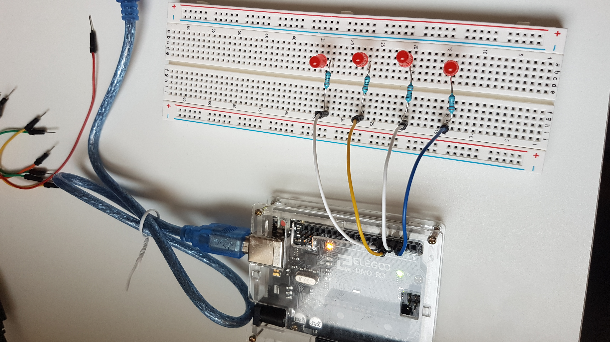
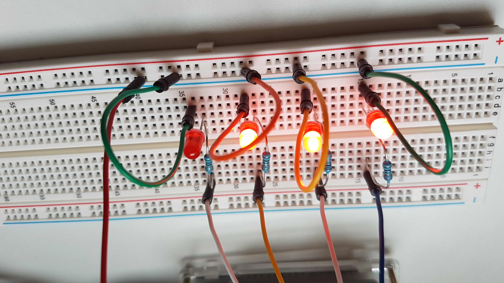
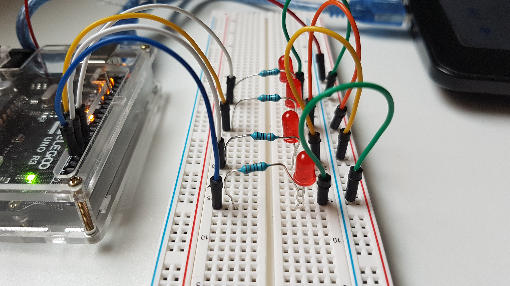

## Project 1: Binary LEDs

### Project Description

Displaying the Binary Representation of an hexadecimal number

### Learning Objectives

1. Build a parallel circuits using LEDs
2. Get familiar with ``pinMode(pin, OUTPUT)`` and ``digitalWrite(pin, OUTPUT)``

### How to build the project

#### Step 1: Mount each LEDs individually with its resistor (330 Ohm)

The resistor should be connected to the long leg (the positive side)

#### Step 2: Create the parallel circuit by linking each LEDs to the ground.

The jumper wire should be linked to the smaller leg (negative side)

### The Result

